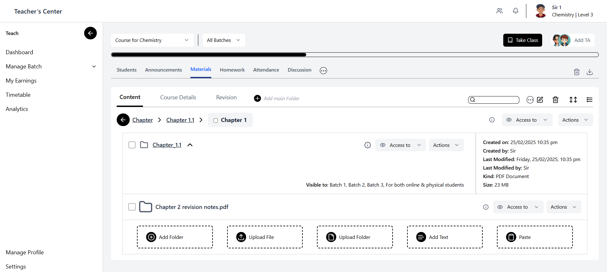
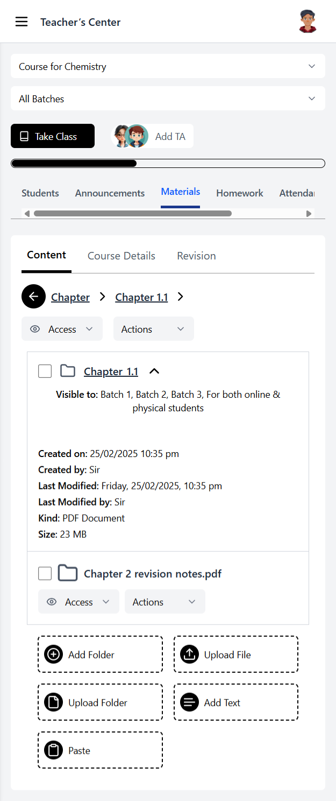

# Dashboard UI

This is a simple, responsive Dashboard UI built with Next.js and Tailwind CSS, designed to provide an intuitive user experience across devices.

## Live Link

Explore the live project [here](https://dashbooard-ui.vercel.app/).

## Preview

  
_Desktop view of the dashboard interface._

  
_Mobile view showcasing responsive design._

## Features

- **Header**: Includes a profile dropdown for quick user actions and settings.
- **Sidebar**: Features a collapsible dropdown menu for seamless navigation.
- **Delete Button**: Comes with a confirmation modal to prevent accidental deletions.
- **Main Content**: Displays all content clearly and organized for easy access.

## Tech Stack

- **Next.js**: A React framework for server-side rendering and static site generation.
- **Tailwind CSS**: A utility-first CSS framework for rapid and responsive styling.
- **Lucide React**: A lightweight, customizable icon library for React applications.

## 💻 Getting Started

Follow these steps to set up and run the project locally:

### 💻 Getting Started

1. Clone the repository:

```bash
git clone https://github.com/mdsajalali/dashboard-ui.git
```

2. Install dependencies:

```
cd dashboard-ui
npm install
```

3. Run the development server:

```
npm run dev
```

Connect with me on [LinkedIn](https://www.linkedin.com/in/mdsajalali/).

Happy coding!
